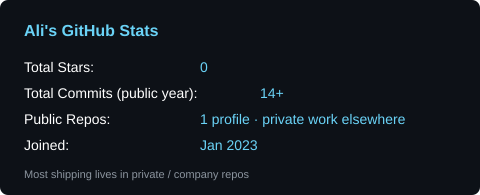
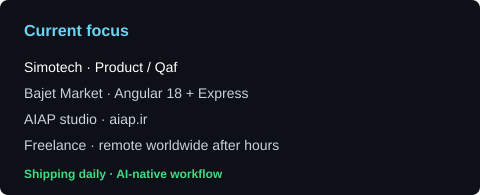
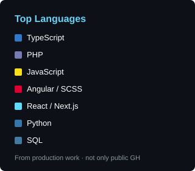

<!-- Header (static assets in this repo — loads via GitHub, not Vercel) -->
<div align="center">
  
</div>

<div align="center">
  
</div>

<!-- Followers & links (shields.io) -->
<div align="center">
  <a href="https://github.com/alipilechiha?tab=followers">
    
  </a>
  &nbsp;
  <a href="https://aiap.ir" target="_blank" rel="noopener noreferrer">
    
  </a>
  &nbsp;
  <a href="https://www.linkedin.com/in/alipilechiha/" target="_blank" rel="noopener noreferrer">
    
  </a>
</div>

<br/>


## About Me

```typescript
const ali: Developer = {
  name: "Ali Pilechiha",
  location: "Tehran, Iran",
  role: "Full-Stack Engineer",
  company: "Simotech (Product / Qaf) · AIAP studio",
  workflow: "AI-native — architecture, repo tree, stack, agents, then my review",
  ships: [
    "Bajet Market (Angular 18 + Express/TS API)",
    "Custom WordPress plugins & WooCommerce gateways",
    "Fintech / marketplace / BNPL products",
    "PWAs, Chrome extensions, Figma plugins",
    "PageSpeed / Core Web Vitals & Screaming Frog SEO"
  ],
  currentFocus: "Bajet Market + BajetPay / Central / Page Builder at Simotech · AIAP studio",
  freelance: "Fully remote, worldwide, outside company hours",
  motto: "Code is like humor. When you have to explain it, it's bad."
};
```

<table align="center">
<tr>
<td width="50%" valign="top">

### What I'm Working On
- **Simotech / Product (Qaf)** — [Bajet Market](https://www.bajetmarket.ir), [MyTripay](https://mytripay.com/en/), [Jetpay](https://jetpay.mybajet.ir/fa/), [Bajet blog](https://blog.mybajet.ir/), [Bajet bot on Bale](https://web.bale.ai/chat?uid=1127363680)
- **GiveCard** *(Simotech, not public yet)* — Next.js + Prisma + Docker
- **AIAP** — personal studio: [aiap.ir](https://aiap.ir)

### Daily AI stack
AI-native every day: architecture, folder trees, tech choices, coding agents, then my review. ChatGPT, Claude, Grok, Perplexity, Codex, Windsurf, Devin, VS Code. Lovable / Bolt / Emergent for prototypes, then harden and ship.

</td>
<td width="50%" valign="top">

### What I Ship
- **Bajet Market** full-stack: Angular 18 SPA + Express/TypeScript API (MongoDB, Redis, Elasticsearch, S3)
- Custom **WordPress plugins and themes** from scratch — Page Builder, marketplace central, payment gateways
- **PageSpeed / Core Web Vitals** and **Screaming Frog** technical SEO on production sites
- Full-stack: **Angular / React / Next.js** + **Node.js** + **PHP / WooCommerce**
- Published **Chrome** and **Figma** extensions · bots · WebSocket chat · AES-256-GCM / TOTP
- Docker, Nginx, PM2, MySQL, Redis, MinIO / RustFS

### Fun facts
- 4 HTML5 games as WordPress plugins
- Started in retail (Apple & Samsung dealerships) — I care about conversion, not only code
- Open to remote freelance worldwide after hours

</td>
</tr>
</table>


## Published now

| Product | Status | Link |
|:--------|:-------|:-----|
| Bajet Market | Live · Simotech | [bajetmarket.ir](https://www.bajetmarket.ir) — Angular 18 + Express/TS |
| MyTripay | Live · Simotech | [mytripay.com](https://mytripay.com/en/) |
| Jetpay | Live · Simotech | [jetpay.mybajet.ir](https://jetpay.mybajet.ir/fa/) |
| Bajet blog | Live · Simotech | [blog.mybajet.ir](https://blog.mybajet.ir/) |
| Bajet bot (Bale) | Live · Simotech | [Open chat](https://web.bale.ai/chat?uid=1127363680) |
| Tehran Speaker | Live | [tehranspeaker.com](https://www.tehranspeaker.com) |
| Multikala | Live | [multikala.com](https://www.multikala.com) |
| AIAP hub | Live · personal | [aiap.ir](https://aiap.ir) |
| Task Manager | Live · personal | [task.aiap.ir](https://task.aiap.ir) |
| Authenticator | Live · personal | [pass.aiap.ir](https://pass.aiap.ir) |
| AIAP One | Live · personal | [one.aiap.ir](https://one.aiap.ir) |
| **AIAP Font** | **Chrome Web Store** | [Install](https://chromewebstore.google.com/detail/aiap-font/bkkidmfmmolehbjjckjejobnbjikmiaf) |
| **AIAP Design to HTML** | **Figma Community** | [Plugin](https://www.figma.com/community/plugin/1650776840837266092/aiap-design-to-html) |

*Not published:* GiveCard (Simotech, early stage)


## Featured Projects

<div align="center">

<table>
<tr>
<td width="50%" valign="top">

### Bajet Market
> BNPL / price-comparison marketplace — Simotech / Product (Qaf) · **live**
- **Frontend:** Angular 18 SPA, Bootstrap 5, Leaflet maps, FA i18n, admin panel, Docker + PM2
- **Backend:** Express + TypeScript — MongoDB, Redis, Elasticsearch, BullMQ, JWT, S3 (MinIO / RustFS)
- Ingest workers, SEO (sitemap/robots), GA / GTM / Clarity on production
- [bajetmarket.ir](https://www.bajetmarket.ir)

</td>
<td width="50%" valign="top">

### Bajet WP plugin suite
> Production plugins powering Jetpay + merchant sync · Simotech
- **BajetPay WooCommerce Gateway v2.1** — credit payments, AES-256-GCM secrets, Blocks + HPOS, product sync
- **Bajetmarket Central v3** — multi-store product ingest (REST), Searchia, image proxy/localizer, auto-categorize
- **Bajet Page Builder v7.2.7** — stores/products archives, story, map, chat widget, credit types, CSP headers
- [jetpay.mybajet.ir](https://jetpay.mybajet.ir/fa/)

</td>
</tr>
<tr>
<td width="50%" valign="top">

### AIAP Font
> Chrome MV3 · **on the Chrome Web Store**
- 9 Persian fonts, Persian numerals, iframe / Shadow DOM
- Fully offline, no data collection
- [Web Store](https://chromewebstore.google.com/detail/aiap-font/bkkidmfmmolehbjjckjejobnbjikmiaf) · [font.aiap.ir](https://font.aiap.ir)

</td>
<td width="50%" valign="top">

### AIAP Design to HTML
> Figma Community plugin · **published**
- Design → clean HTML
- [Figma Community](https://www.figma.com/community/plugin/1650776840837266092/aiap-design-to-html)

</td>
</tr>
<tr>
<td width="50%" valign="top">

### AIAP Authenticator
> 2FA like Google Authenticator — WordPress + PWA
- TOTP (RFC 6238), AES-256-GCM, WebAuthn, QR, audit logs
- [pass.aiap.ir](https://pass.aiap.ir)

</td>
<td width="50%" valign="top">

### AIAP One + Task Manager
> Personal studio products · **live**
- [one.aiap.ir](https://one.aiap.ir) — E2E one-time links (AES-GCM in browser)
- [task.aiap.ir](https://task.aiap.ir) — Kanban PWA (boards, Jalali, notifications)

</td>
</tr>
<tr>
<td width="50%" valign="top">

### Tehran Speaker
> E-commerce rebuild · **live**
- OpenCart → custom WordPress/WooCommerce theme
- Technical SEO (GSC, Screaming Frog, Clarity)
- [chat](https://chat.tehranspeaker.com) · [careers](https://careers.tehranspeaker.com) · [tools](https://tools.tehranspeaker.com)

</td>
<td width="50%" valign="top">

### More WordPress / bots
> Production + personal
- LiveChat (WebSocket, voice, RTL), Universal API, Journey, Plus, Minimod
- HTML5 game plugins · Momtaz loan bot (Telegram + Bale)

</td>
</tr>
</table>

</div>


## Tech I actually ship with

<div align="center">

### Languages


### Frontend


### Backend & CMS


### Data & infra


### Product, SEO & AI workflow


</div>


## Snapshot

<div align="center">

| Category | Notes |
|:---------|:------|
| Fintech (Simotech) | **Bajet Market** Angular 18 + Express/Mongo/Redis/ES/S3 — **live**. Jetpay = BajetPay WC gateway. WP: Central v3, Page Builder v7.2.7. MyTripay, blog, Bale bot. GiveCard — **WIP** |
| WordPress (Bajet) | BajetPay 2.1 (AES-256-GCM, Blocks/HPOS), Central (multi-store ingest + Searchia), Page Builder (stores/products/story/map/chat) |
| Personal studio (AIAP) | Hub, task, 2FA, One, Font (Web Store), Design-to-HTML (Figma) |
| Tehran Speaker | OpenCart → custom WooCommerce · chat / careers / tools |
| Multikala | E-commerce technical lead · still active remote |
| WordPress | Custom plugins beyond Bajet: LiveChat, API, Journey, Plus, Minimod, HTML5 games |
| Bots | Bajet on Bale · Momtaz (Telegram + Bale) |

</div>


## Snapshot cards

<!-- Static SVGs hosted in this repo (Iran-friendly: GitHub raw, no Vercel widgets) -->
<div align="center">
  
  
</div>

<br/>

<div align="center">
  
</div>


## Let's work

<div align="center">

**Full-time:** Simotech (on-site, Tehran)  
**Freelance:** fully remote, worldwide, outside company hours

</div>

<br/>

<div align="center">
  <a href="https://linkedin.com/in/alipilechiha" target="_blank">
    
  </a>
  &nbsp;
  <a href="https://instagram.com/alipilechiha" target="_blank">
    
  </a>
  &nbsp;
  <a href="https://t.me/alipilechiha" target="_blank">
    
  </a>
  &nbsp;
  <a href="https://web.bale.ai/@alipilechiha" target="_blank">
    
  </a>
  &nbsp;
  <a href="mailto:ali.pilechiha@gmail.com" target="_blank">
    
  </a>
  &nbsp;
  <a href="https://aiap.ir" target="_blank">
    
  </a>
</div>

<br/>

<div align="center">
  
</div>

<br/>

<div align="center">
  
</div>

<div align="center">
  
</div>
